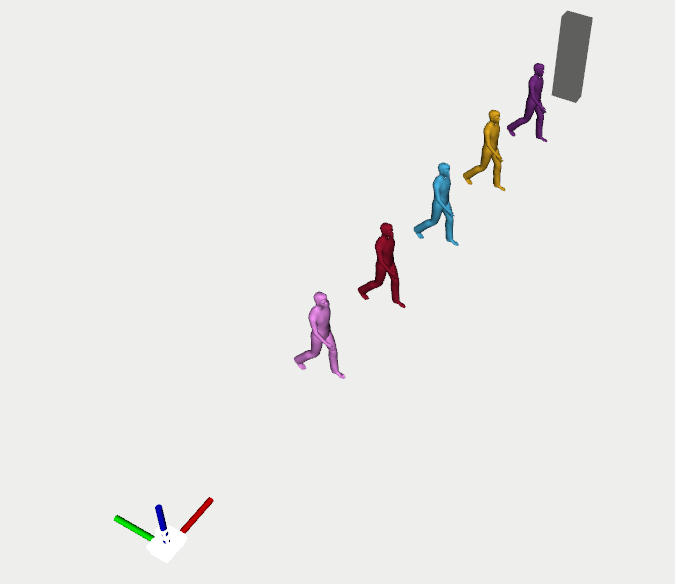

# Overview
This package provides the following utilities for using the Vicon motion capture system:

1. Running an EKF on dynamic objects to estimate their velocity (`launch_ekfs.launch`, `scripts/launch_ekfs.py`)
2. Bundling dynamic and static objects in a single `derived_object_msgs/ObjectArray` message (`bundle_obstacles.launch`, `obstacle_bundle_node.cpp`)
3. Visualizing the bundled obstacles (`visualize_scene.cpp`)
3. Spoofing Vicon input to work outside of the lab (`spoof_vicon.launch`, `spoof_vicon_node.cpp`)

## Installation
In your `ROS1` workspace:

```
sudo apt-get update
cd src
git clone https://github.com/tud-amr/vicon_util.git
git clone https://github.com/oscardegroot/ros_tools.git
cd ros_tools
python3 switch_to_ros.py 1
cd ../../
rosdep install -y --from-paths src --ignore-src
```

The `ros_tools` package is necessary for visualization.

## Usage
There is an example launch file under `launch/example.launch`.

An example launch file that reads the state of robot `jackal3`, 5 dynamic objects and a static object, deploys an EKF on everything but the static object and visualizes the scene looks as follows:

```xml
<launch>
  <!-- Bundle dynamic obstacles in one convenient message -->
  <include file="$(find vicon_util)/launch/bundle_obstacles.launch">
    <arg name="run_ekfs" value="true"/>
    <arg name="visualize_scene" value="true"/>
    <arg name="robot_topic" value="jackal3"/>
    <arg name="dynamic_object_topics" default="[jackal3, dynamic_object1, dynamic_object2, dynamic_object3, dynamic_object4, dynamic_object5]"/>
    <arg name="dynamic_object_radius" default="0.4"/>
    <arg name="static_object_topics" default="[rectangle2x1_1]"/>
    <arg name="static_object_radius" default="0.3"/>
    <arg name="static_object_sizes" default="[2]"/>
  </include>
</launch>
```

Details of the object message are here: http://docs.ros.org/en/kinetic/api/derived_object_msgs/html/msg/ObjectArray.html
The shape is populated as box for static obstacles and cylinders for dynamic obstacles.

---

The bundle utility should be combined with the spoof Vicon or real Vicon system as follows:

```xml
<launch>

    <!-- Spoof the Vicon system (disable if the real vicon is used) -->
    <include file="$(find vicon_util)/launch/spoof_vicon.launch">
        <arg name="topics" default="[jackal3, dynamic_object1, dynamic_object2, dynamic_object3, dynamic_object4, dynamic_object5, rectangle2x1_1]"/>
        <arg name="message_types" default="[geometry_msgs/PoseWithCovarianceStamped, geometry_msgs/PoseWithCovarianceStamped, geometry_msgs/PoseWithCovarianceStamped, geometry_msgs/PoseWithCovarianceStamped, geometry_msgs/PoseWithCovarianceStamped, geometry_msgs/PoseWithCovarianceStamped, geometry_msgs/PoseWithCovarianceStamped]"/>
    </include>

    <!-- Start the vicon bridge -->
    <include file="$(find vicon_bridge)/launch/vicon.launch">
        <arg name="object_names" value="[jackal3, dynamic_object1, dynamic_object2, dynamic_object3, dynamic_object4, dynamic_object5, rectangle2x1_1]"/>
        <arg name="object_msg_types" default="[geometry_msgs/PoseWithCovarianceStamped, geometry_msgs/PoseWithCovarianceStamped, geometry_msgs/PoseWithCovarianceStamped, geometry_msgs/PoseWithCovarianceStamped, geometry_msgs/PoseWithCovarianceStamped, geometry_msgs/PoseWithCovarianceStamped, geometry_msgs/PoseWithCovarianceStamped]"/>
        <arg name="object_frame_ids" default="[map, map, map, map, map, map, map]"/>
        <arg name="object_publish_topics" default="[/vicon/jackal3, /vicon/dynamic_object1, /vicon/dynamic_object2, /vicon/dynamic_object3, /vicon/dynamic_object4, /vicon/dynamic_object5, /vicon/rectangle2x1_1]"/>
        <arg name="object_frequency_divider" default="[2, 2, 2, 2, 2, 2, 2]"/>
    </include>

    <!-- Bundle dynamic obstacles in one convenient message -->
    <include file="$(find vicon_util)/launch/bundle_obstacles.launch">
        <arg name="run_ekfs" value="true"/>
        <arg name="visualize_scene" value="true"/>
        <arg name="robot_topic" value="jackal3"/>
        <arg name="dynamic_object_topics" default="[jackal3, dynamic_object1, dynamic_object2, dynamic_object3, dynamic_object4, dynamic_object5]"/>
        <arg name="dynamic_object_radius" default="0.4"/>
        <arg name="static_object_topics" default="[rectangle2x1_1]"/>
        <arg name="static_object_radius" default="0.3"/>
        <arg name="static_object_sizes" default="[2]"/>
    </include>
</launch>
```

Example visualization with the fake Vicon:



## Jackal
To see the Jackal model, you have to install `jackal_description` and visualize `RobotModel`.

```
sudo apt-get install ros-noetic-jackal-description
```

Add in the launch file:
```
<include file="$(find jackal_description)/launch/description.launch"/>
```

## Disclaimer
To be tested with the real vicon...
